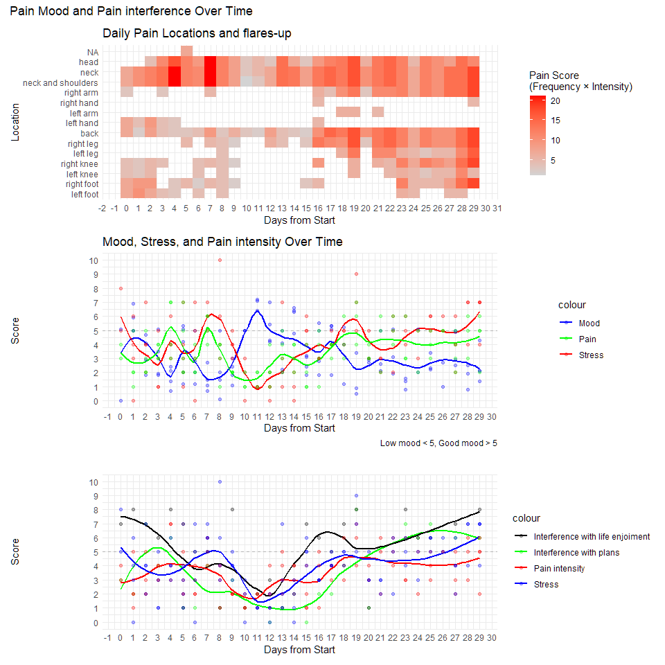
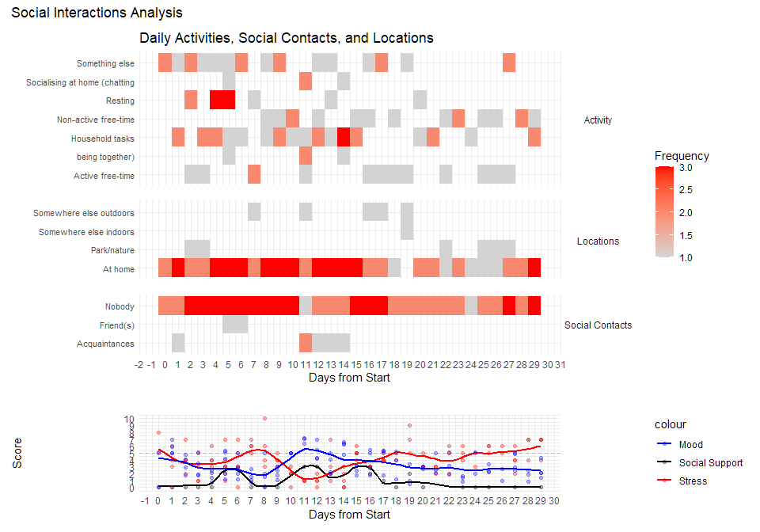

EMA single case data
================
29 November, 2024

- [Case details](#case-details)
  - [BASELINE DATA:](#baseline-data)
    - [BPI](#bpi)
    - [Psychological wellbeing](#psychological-wellbeing)
- [data prep](#data-prep)
- [Reported pain locations](#reported-pain-locations)
  - [Daily Pain Locations and
    flares-up](#daily-pain-locations-and-flares-up)
- [Daily Mood, Stress, and pain
  intensity](#daily-mood-stress-and-pain-intensity)
  - [Daily pain interference](#daily-pain-interference)
  - [Pain Mood and Pain interference Over
    Time](#pain-mood-and-pain-interference-over-time)
  - [Social Activity](#social-activity)

# Case details

- Sex: F
- Age: 32

## BASELINE DATA:

### BPI

The BPI allows patients to rate the severity of their pain and the
degree to which their pain interferes with common dimensions of feeling
and function. The interference scale includes seven domains: 1. General
activity, 2. Mood, 3. Walking ability, 4. Normal work (including
housework), 5. Relations with other people, 6. Sleep, and 7. Enjoyment
of life.

**Pain Location**

- Lower Back
- Right hand
- Left Glute
- Left leg

**Pain intensity in the previous 24h:**

|         | score   |
|---------|---------|
| worst   | 10/10   |
| average | 6.75/10 |

**Pain interference in the previous 24h:**

|         | score   |
|---------|---------|
| average | 7.85/10 |

**Pain Medication**

- Amitriptyline (tricyclic antidepressant)

- duloxetine (SNRI)

- codeine (opioid medication)

- naproxen (NSAID)

### Psychological wellbeing

#### PHQ9

The PHQ-9 is a 9 item questionnaire aimed at scoring each of the nine
DSM-IV criteria. It is generally used to monitor the severity of
depression symptomatology and considers scores above 20 as *severe*
(range 0:27).

|          | score |
|----------|-------|
| **PHQ9** | 24/27 |

#### PSEQ

The Pain Self-Efficacy Questionnaire (PSEQ) is a 10-item questionnaire
developed to assess the confidence people with ongoing pain have in
performing activities while in pain. The scoring range is 0:60 with
higher scores indicating greater confidence in dealing with pain. Scores
of 40 (percentile 50) are generally associated with favourable chance of
“returning to work”, lower scores (for example a raw score of 30,
percentile = 18) tend to predict less sustainable gains.

The PSEQ scores are helpful in developing a formulation around
psychological factors (e.g. beliefs) that influence the respondent’s
reaction to injury and pain.

|          | score |
|----------|-------|
| **PSEQ** | 16/60 |

# data prep

# Reported pain locations

<!-- -->

## Daily Pain Locations and flares-up

    ## `summarise()` has grouped output by 'day_count'. You can override using the
    ## `.groups` argument.

    ## Warning: Removed 1 row containing missing values or values outside the scale range
    ## (`geom_tile()`).

<!-- -->

# Daily Mood, Stress, and pain intensity

    ## `geom_smooth()` using formula = 'y ~ x'
    ## `geom_smooth()` using formula = 'y ~ x'
    ## `geom_smooth()` using formula = 'y ~ x'

<!-- -->

## Daily pain interference

    ## `geom_smooth()` using formula = 'y ~ x'
    ## `geom_smooth()` using formula = 'y ~ x'
    ## `geom_smooth()` using formula = 'y ~ x'
    ## `geom_smooth()` using formula = 'y ~ x'

<!-- -->

## Pain Mood and Pain interference Over Time

    ## `geom_smooth()` using formula = 'y ~ x'
    ## `geom_smooth()` using formula = 'y ~ x'
    ## `geom_smooth()` using formula = 'y ~ x'
    ## `geom_smooth()` using formula = 'y ~ x'
    ## `geom_smooth()` using formula = 'y ~ x'
    ## `geom_smooth()` using formula = 'y ~ x'
    ## `geom_smooth()` using formula = 'y ~ x'

<!-- -->

## Social Activity

    ## `geom_smooth()` using formula = 'y ~ x'
    ## `geom_smooth()` using formula = 'y ~ x'
    ## `geom_smooth()` using formula = 'y ~ x'

<!-- -->
