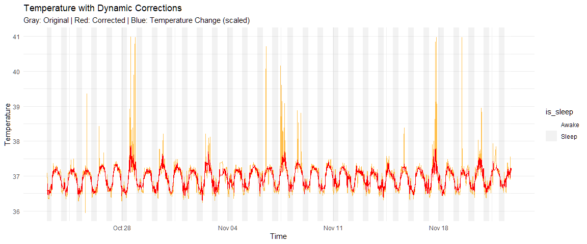
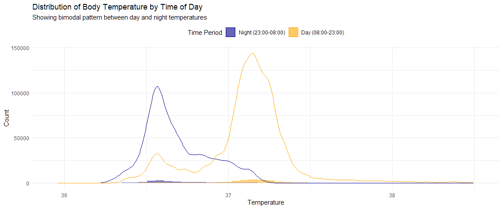
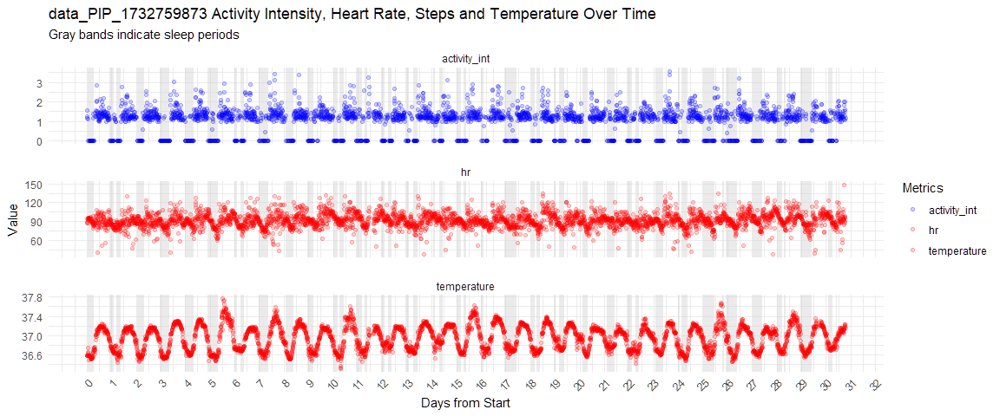
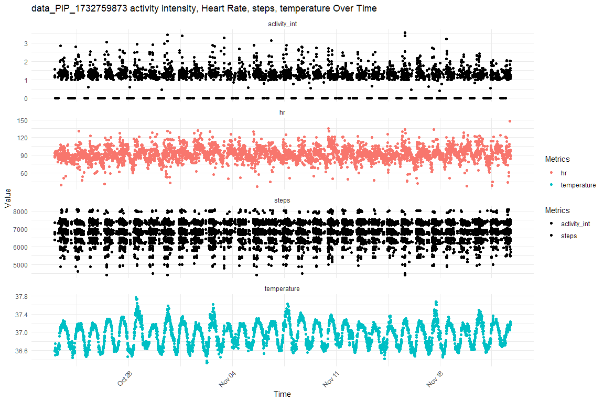

EMA single case data
================
04 December, 2024

- [BODY temperature](#body-temperature)
- [STEPS](#steps)
- [Heart Rate](#heart-rate)
- [Activity Intensity](#activity-intensity)
- [Sleep states](#sleep-states)
  - [Sleep summary](#sleep-summary)
- [ECG](#ecg)
- [Merge steps, activity, hr,
  temperature](#merge-steps-activity-hr-temperature)
- [Sleep detection](#sleep-detection)
  - [explore missing hr datapoints](#explore-missing-hr-datapoints)
  - [explore missing Temperature
    datapoints](#explore-missing-temperature-datapoints)
- [OTHER derived](#other-derived)

    ## 
    ## Attaching package: 'dplyr'

    ## The following objects are masked from 'package:stats':
    ## 
    ##     filter, lag

    ## The following objects are masked from 'package:base':
    ## 
    ##     intersect, setdiff, setequal, union

    ## 
    ## Attaching package: 'lubridate'

    ## The following objects are masked from 'package:base':
    ## 
    ##     date, intersect, setdiff, union

    ## 
    ## Attaching package: 'zoo'

    ## The following objects are masked from 'package:base':
    ## 
    ##     as.Date, as.Date.numeric

set participant data folder

``` r
#folder_name<-"data_ART_1727097278"
#  start_date<-"2024-09-20 06:00:00"
#  end_date  <-"2024-09-25 06:00:00"

folder_name<-"data_PIP_1732759873"
  start_date<-"2024-10-22 06:00:00"
  end_date  <-"2024-11-23 06:00:00"

#folder_name<-"data_JAA_1727098304"
#  start_date<-"2024-09-04 06:00:00"
#  end_date  <-"2024-09-12 06:00:00"

#folder_name<-"data_CEC_1727186111"
#  start_date<-"2024-08-29 06:00:00"
#  end_date  <-"2024-09-08 06:00:00"


path<-paste0("C:/Users/d.vitali/Desktop/Github/CRIISP-WP6/Data/",folder_name,"/")
```

# BODY temperature

monitored ~ 1400/day (~58/hr)

    ## # A tibble: 31 × 2
    ##    day        non_na_count
    ##    <date>            <int>
    ##  1 2024-10-23         1436
    ##  2 2024-10-24         1440
    ##  3 2024-10-25         1430
    ##  4 2024-10-26         1440
    ##  5 2024-10-27         1440
    ##  6 2024-10-28         1420
    ##  7 2024-10-29         1440
    ##  8 2024-10-30         1430
    ##  9 2024-10-31         1429
    ## 10 2024-11-01         1440
    ## # ℹ 21 more rows

\##Temperature cleaning

Temperature changes are key indicators of sleep/wake transitions -
Temperature naturally drops during sleep onset 2,5 - Warmer temperatures
accompany waking up from being asleep 3

data cleaning should suit this:

1.  Detect temperature change patterns 5
2.  detect and correct drifts and spikes Using a single rolling mean but
    accounts for natural temperature variations throughout sleep/awake
    cycle

<!-- --><!-- -->

    ## # A tibble: 2 × 6
    ##   likely_awake mean_temp sd_temp median_temp   q25   q75
    ##   <lgl>            <dbl>   <dbl>       <dbl> <dbl> <dbl>
    ## 1 FALSE             36.7   0.197        36.6  36.5  36.8
    ## 2 TRUE              37.1   0.278        37.1  37.0  37.2

# STEPS

ad hoc (whenever more than 0 step is recorded)

    ## # A tibble: 31 × 2
    ##    day        non_na_count
    ##    <date>            <int>
    ##  1 2024-10-23          407
    ##  2 2024-10-24          349
    ##  3 2024-10-25          374
    ##  4 2024-10-26          402
    ##  5 2024-10-27          430
    ##  6 2024-10-28          351
    ##  7 2024-10-29          310
    ##  8 2024-10-30          383
    ##  9 2024-10-31          388
    ## 10 2024-11-01          377
    ## # ℹ 21 more rows

# Heart Rate

monitored ~ 140/day (~6/hr)

    ## # A tibble: 31 × 2
    ##    day        non_na_count
    ##    <date>            <int>
    ##  1 2024-10-23          134
    ##  2 2024-10-24          134
    ##  3 2024-10-25          139
    ##  4 2024-10-26          136
    ##  5 2024-10-27          133
    ##  6 2024-10-28          134
    ##  7 2024-10-29          140
    ##  8 2024-10-30          130
    ##  9 2024-10-31          140
    ## 10 2024-11-01          139
    ## # ℹ 21 more rows

# Activity Intensity

monitored ~ 200/day (~8/hr)

    ## # A tibble: 31 × 2
    ##    day        non_na_count
    ##    <date>            <int>
    ##  1 2024-10-23          442
    ##  2 2024-10-24          382
    ##  3 2024-10-25          405
    ##  4 2024-10-26          454
    ##  5 2024-10-27          468
    ##  6 2024-10-28          397
    ##  7 2024-10-29          352
    ##  8 2024-10-30          411
    ##  9 2024-10-31          423
    ## 10 2024-11-01          401
    ## # ℹ 21 more rows

# Sleep states

    ## # A tibble: 31 × 2
    ##    day        non_na_count
    ##    <date>            <int>
    ##  1 2024-10-23           35
    ##  2 2024-10-24           33
    ##  3 2024-10-25           31
    ##  4 2024-10-26           53
    ##  5 2024-10-27           38
    ##  6 2024-10-28           46
    ##  7 2024-10-29           42
    ##  8 2024-10-30           28
    ##  9 2024-10-31           35
    ## 10 2024-11-01           24
    ## # ℹ 21 more rows

## Sleep summary

# ECG

# Merge steps, activity, hr, temperature

# Sleep detection

<!-- -->

\#MISSINGNESS

## explore missing hr datapoints

<!-- -->

## explore missing Temperature datapoints

<!-- -->

# OTHER derived

raw_tracker_ACTIREC_FEAT.csv
<!-- -->
